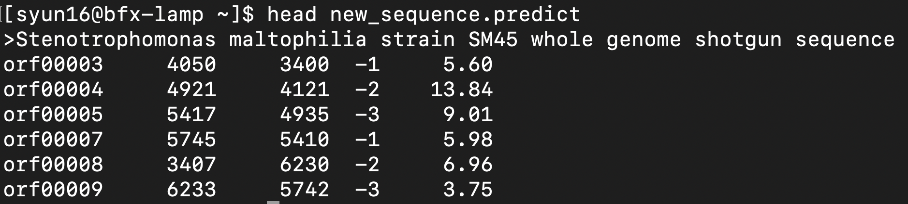
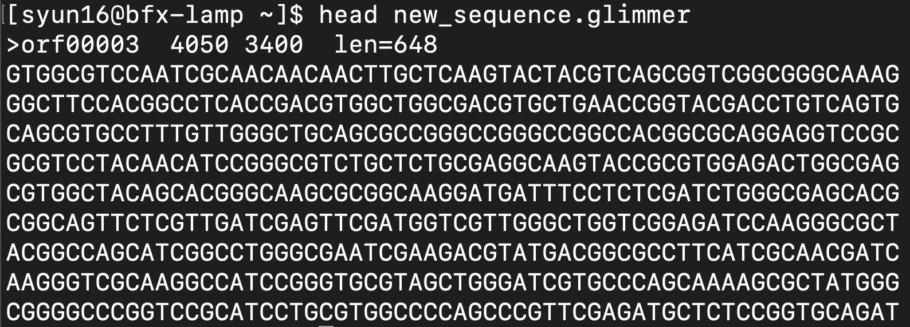

# Case Study: Prokaryotic Gene Prediction Using GLIMMER

## Overview
This case study demonstrates gene prediction in a prokaryotic genome using **GLIMMER (Gene Locator and Interpolated Markov ModelER)**, a widely used tool for identifying coding regions in microbial DNA. GLIMMER is particularly effective for bacteria because genes are densely packed and long open reading frames (ORFs) are highly indicative of true genes.

The workflow involves training a model on a known genome and applying it to a newly sequenced genome to predict gene locations and sequences.

---

## Objectives
- Train a gene prediction model using a known bacterial genome  
- Identify open reading frames (ORFs)  
- Predict gene start and stop positions in a new genome  
- Extract predicted gene sequences  

---

## Input Data
- `genome.fasta` → Known reference genome (training data)  
- `new_sequence.fasta` → Newly sequenced genome (prediction target)  

---

## Methodology

### Step 1: Generate Long Open Reading Frames
Long ORFs are extracted from the reference genome to serve as a high-confidence training set.

```bash
long-orfs -n -t 1.15 genome.fasta genome.longorfs
```
### Step 2: Extract Training Sequences
The identified ORFs are converted into sequence format for model training.

```bash
extract -t genome.fasta genome.longorfs > genome.train
```
### Step 3: Build the Interpolated Context Model (ICM)
GLIMMER builds a probabilistic model based on coding patterns in the training sequences.

```bash
build-icm -r genome.icm < genome.train
```
### Step 4: Predict Genes in New Sequence
The trained model is applied to the new genome to predict gene locations.
```bash
glimmer3 -o50 -g110 -t30 new_sequence.fasta genome.icm new_sequence
```
Key outputs:

`new_sequence.predict` → Predicted gene coordinates and scores

### Step 5: Inspect Predictions
View the first few predicted genes:

```bash
head new_sequence.predict
```


### Step 6: Extract Predicted Gene Sequences
Convert predicted coordinates into actual nucleotide sequences:
```bash
extract -t new_sequence.fasta new_sequence.predict > new_sequence.glimmer
```
### Step 7: Review Extracted Sequences
```bash
head new_sequence.glimmer
```


Note:
You may encounter a warning related to header lines (starting with >). This can be safely ignored if the output sequences are generated correctly.

## Results
* Identification of predicted genes in the new genome
* Start and stop coordinates for each gene
* FASTA-formatted sequences of predicted coding regions

## Key Concepts
* Open Reading Frames (ORFs): Continuous stretches of codons that may encode proteins
* Interpolated Context Model (ICM): A statistical model capturing coding sequence patterns
* Model Training: Improves prediction accuracy by learning organism-specific features

## Interpretation
GLIMMER leverages the structure of prokaryotic genomes, where genes are typically long and uninterrupted. By training on known genomic data, the model can accurately predict gene boundaries in newly sequenced genomes. This approach is especially useful for annotating novel bacterial genomes.

## Limitations
* Less effective for short genes or overlapping genes
* Accuracy depends on the quality of the training genome
* Not suitable for eukaryotic genomes with introns

## Applications
* Genome annotation in bacteria and archaea
* Comparative genomics
* Identification of novel genes in newly sequenced organisms