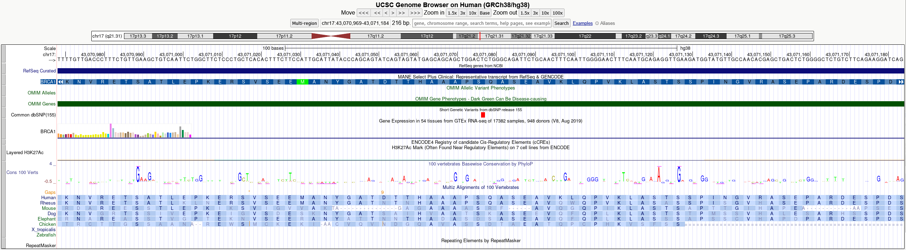
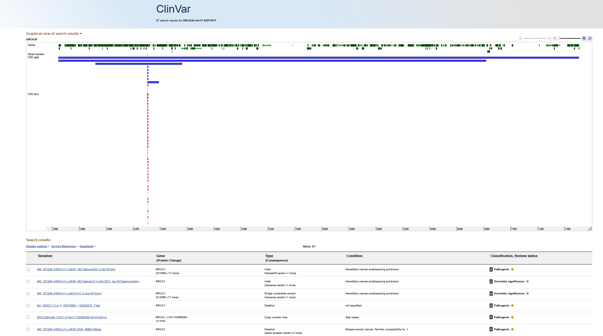
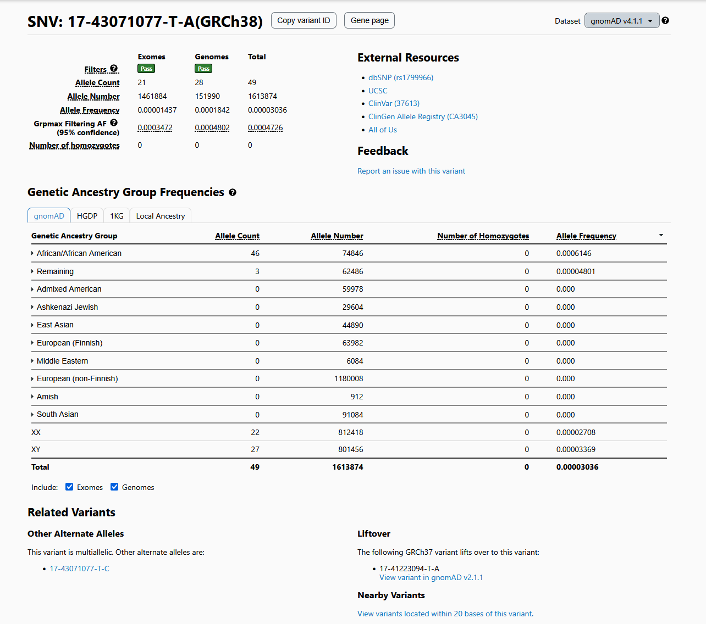

# Case Study: Variant Interpretation

Variant interpretation is a key step in clinical and research genomics, where identified genetic variants are assessed for potential biological or disease relevance using multiple databases and annotation tools.

---

## Question

A missense variant is identified in a patient sample:

- **Gene:** BRCA1  
- **Variant:** chr17:43071077 T > A  
- **Type:** Missense variant  

The goal is to determine whether this variant is likely benign, pathogenic, or of uncertain significance.

---

## Tools Used

- **UCSC Genome Browser** – for genomic context and visualization of the variant location  
- **ClinVar** – for clinical significance classification of known variants  
- **gnomAD** – for population frequency data to assess how common the variant is in healthy populations  

---

## Steps

1. Locate the variant in UCSC Genome Browser
   - Confirm genomic position on chromosome 17
   - Identify whether the variant lies within an exon or functional domain of BRCA1

2. Check ClinVar database
   - Search variant location (chr17:43071077)
   - Review clinical classifications (Pathogenic, Likely pathogenic, Benign, VUS)

3. Check population frequency in gnomAD
   - Determine allele frequency across global populations
   - Identify whether the variant is rare or common

4. Integrate functional context
   - Assess whether amino acid change occurs in a conserved or functionally important region
   - Compare evidence across databases

---

## Result

- Variant is present at very low or absent for some populations in gnomAD
- ClinVar classification shows conflicting interpretations or “Variant of Uncertain Significance (VUS)"
- Located within an exon of BRCA1

---

## Interpretation

Based on available evidence:
- The rarity of the variant in population databases suggests it is unlikely to be a common benign polymorphism  
- However, lack of consistent clinical evidence prevents definitive classification  
- The variant is best classified as a VUS

Further functional studies or additional clinical case data would be required to refine classification.

---

## Summary

This case demonstrates how variant interpretation relies on integrating:
- Genomic context (UCSC Genome Browser)  
- Clinical evidence (ClinVar)  
- Population frequency (gnomAD)  

Together, these resources support evidence-based classification of genetic variants in both research and clinical settings.
