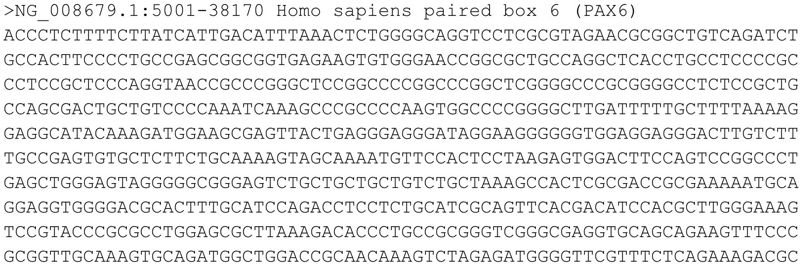
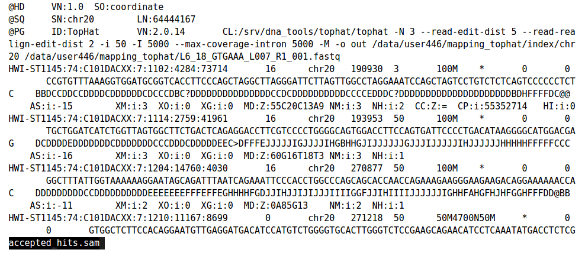
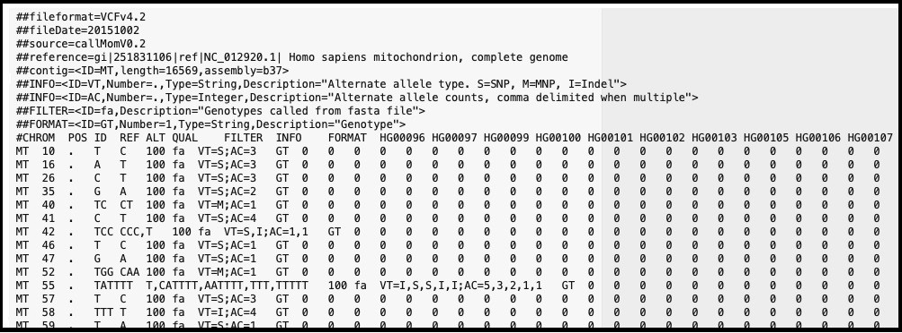

# Common File Formats
Modern sequencing workflows rely on standardized file formats to store and process large-scale genomic data. Three of the most essential formats are FASTQ, SAM/BAM, and VCF, each representing a different stage of analysis.

---

## FASTA
The FASTA format is one of the simplest and most widely used formats in bioinformatics. It is used to store nucleotide or protein sequences **without quality information**. FASTA files are commonly used as reference genomes, transcriptomes, or input for alignment tools.

Each sequence in a FASTA file consists of:
1. A header line beginning with `>` followed by a sequence identifier and optional description  
2. One or more lines of sequence data  

**Example:**

https://compgenomr.github.io/book/fasta-and-fastq-formats.html

Unlike FASTQ, FASTA does not include quality scores, making it more compact and suitable for representing reference sequences or curated datasets.

**Common uses:**
- Reference genomes for alignment (e.g., input to tools like BWA or Bowtie)  
- Protein or gene sequence databases (e.g., BLAST searches)  
- Storing assembled sequences (contigs or transcripts)  

## FASTQ
The FASTQ format is used to store raw sequencing reads along with their associated quality scores. It is typically the first file generated by sequencing platforms.

Each read in a FASTQ file consists of four lines:
1. A sequence identifier (begins with `@`)
2. The nucleotide sequence
3. A separator line (usually `+`)
4. A string of quality scores corresponding to each base

**Example:**

https://www.drive5.com/usearch/manual/fastq_files.html

Quality scores are encoded using ASCII characters and represent the probability of an incorrect base call (Phred score). These scores are critical for downstream quality control and filtering steps.

---

## SAM / BAM

The SAM (Sequence Alignment/Map) format stores aligned sequencing reads relative to a reference genome. Because SAM files are large and text-based, they are often converted into BAM (Binary Alignment/Map), a compressed binary version that is more efficient for storage and computation.

A SAM file contains:
- A header section (metadata about the reference genome and alignment)
- Alignment records for each read

**Key fields include:**
- Read name
- Mapping position
- Mapping quality
- CIGAR string (describes alignment operations such as matches, insertions, deletions)

**Example:**

https://medium.com/@shilparaopradeep/samtools-guide-learning-how-to-filter-and-manipulate-with-sam-bam-files-2c28b25d29e8

BAM files are widely used in tools such as SAMtools for sorting, indexing, and querying alignments efficiently.

---

## VCF

The VCF (Variant Call Format) is used to store genetic variants identified from sequencing data, such as single nucleotide polymorphisms (SNPs), insertions, and deletions.

A VCF file includes:
- A header section defining metadata and annotations
- Variant records with detailed information

**Key columns:**
- Chromosome (CHROM)
- Position (POS)
- Reference allele (REF)
- Alternate allele (ALT)
- Quality score (QUAL)
- Filter status (FILTER)
- Additional annotations (INFO)

**Example:**

https://www.seqanswers.com/articles/324524-vcf-a-guide-to-key-file-formats-for-sequencing-data

VCF files are essential for downstream analysis, including variant annotation using tools like Variant Effect Predictor (VEP) and clinical interpretation.

---
## Summary

- **FASTA** → Reference or known sequences (no quality scores)
- **FASTQ** → Raw sequencing reads with quality scores  
- **SAM/BAM** → Aligned reads mapped to a reference genome  
- **VCF** → Identified genetic variants  

These formats represent the core data flow of NGS pipelines, from raw data generation to biological interpretation.
