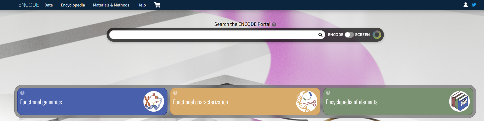
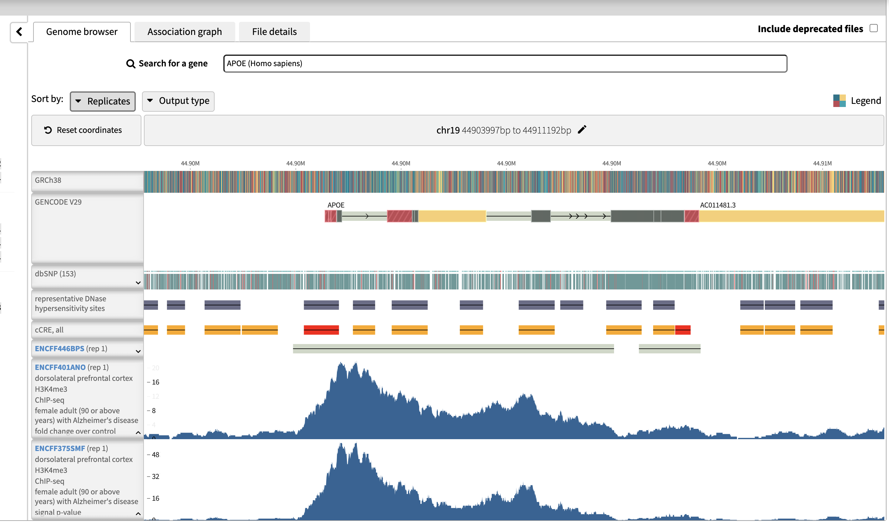
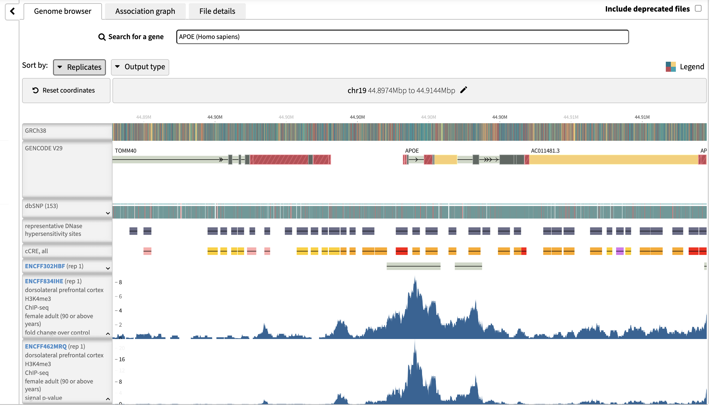
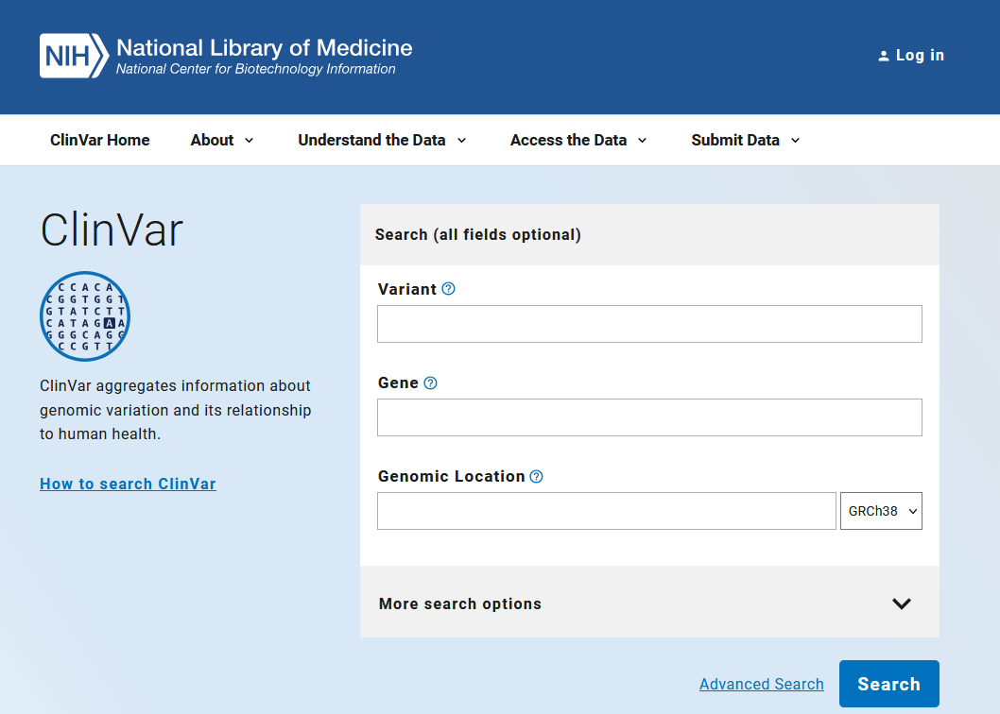
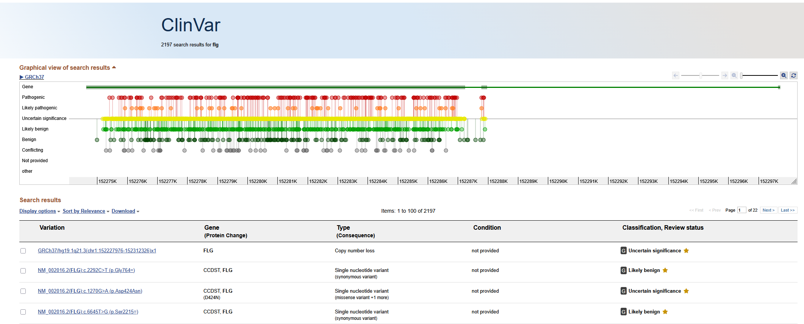
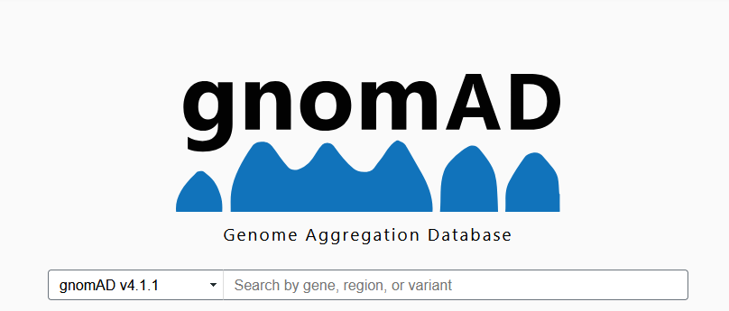
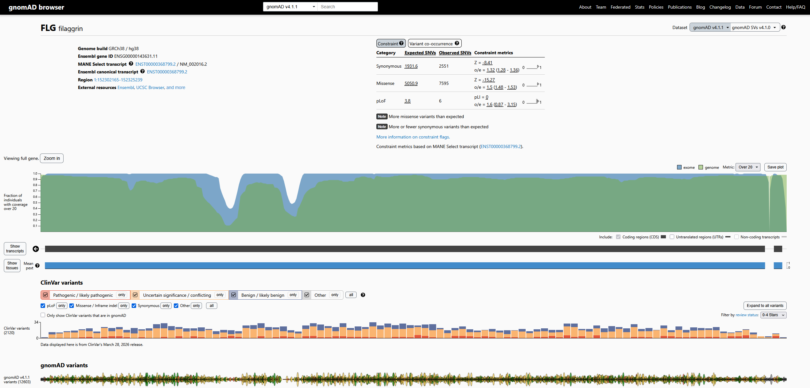

# Public Databases  

Public genome databases provide access to large-scale biological datasets that support gene annotation, variant interpretation, and functional genomics.  

In practice, I don’t use these in isolation. They’re most useful when combined with genome browsers (especially UCSC) to add context to what I’m seeing.

This section covers three key resources:
- [ENCODE](https://www.encodeproject.org/) (functional genomics)
- [ClinVar](https://www.ncbi.nlm.nih.gov/clinvar/) (clinical variation)
- [gnomAD](https://gnomad.broadinstitute.org/) (population variation)

---

# ENCODE

## Overview  
[ENCODE](https://www.encodeproject.org/) (Encyclopedia of DNA Elements) is a large-scale project aimed at identifying functional elements in the genome, particularly regulatory regions like promoters and enhancers.

*ENCODE landing page*

## Type of Data  
- Regulatory elements (enhancers, promoters)  
- Chromatin accessibility (DNase-seq, ATAC-seq)  
- Histone modifications (e.g., H3K27ac, H3K4me3)  
- Transcription factor binding (ChIP-seq)  
- RNA expression data

## Use Cases
- Identify regulatory regions near a gene  
- Determine if a region is transcriptionally active 
- See if a variant falls in a functional noncoding region
- Understand epigenetic context

## Example Query (Module 11)
### Goal: Compare H3K4me3 signal between Alzheimer's disease patients vs. control patients

**Alzheimer's Disease:**
1. Go to [ENCODE](https://www.encodeproject.org/)
2. Click "Rush Alzheimer's"
3. Click the icon of H3K4me3 ChIP-seq & ENCDO258GJF 90+ years, female
4. Click the "Histone ChIP-seq in dorsolateral prefrontal cortex" link
5. Click the "Genome browser" tab, and type APOE in the search box
6. Expand the ChIP-seq peak graphs as below

**Control:**
1. Do the same steps for the control tab for the ENCDO250PFZ, 90+ years, female dataset
2. Compare with the Alzheimer's case
3. Note the highest peak heights

Control results for H3K4me3

## Interpretation Tips  
- H3K27ac + open chromatin → strong indicator of active enhancer/promoter  
- Overlap across multiple ENCODE tracks increases confidence  
- Cell type matters as activity may be tissue-specific  
- Noncoding ≠ nonfunctional

## Limitations  
- Data is cell-type specific (not universal)  
- Not all tissues or conditions are represented  
- Can be easy to overinterpret weak signals  
- Requires integration with other data for conclusions  

---

# ClinVar  

## Overview  
[ClinVar](https://www.ncbi.nlm.nih.gov/clinvar/) is a public database that aggregates information about genomic variants and their relationship to human disease, with clinical significance annotations.

ClinVar landing page

## Type of Data  
- Variant classifications (pathogenic, benign, VUS, etc.)  
- Clinical significance interpretations  
- Supporting evidence and submitter information  
- Links to conditions and phenotypes  

## Use Cases
- Determine if a variant is clinically relevant
- Check if a variant has been previously reported  
- Compare clinical interpretations across labs  
- Support variant classification decisions

## Example Query  
### Goal: Evaluate the clinical significance of a variant  

1. Search variant ID or gene name in ClinVar  
2. Review:
   - Clinical significance (pathogenic, benign, VUS)  
   - Condition associations  
   - Review status (stars)  
3. Compare submissions from different labs  
4. Follow links to supporting evidence  

ClinVar example for "FLG" gene search

## Interpretation Tips  
- Review status matters (more stars = higher confidence)  
- Conflicting interpretations are common, look at evidence  
- “VUS” does not mean harmless, it means uncertain  
- Always consider phenotype context

## Limitations  
- Conflicting interpretations between submitters  
- Not all variants are represented  
- Evidence quality varies  
- Clinical assertions may become outdated  

---

# gnomAD  

## Overview  
[gnomAD](https://gnomad.broadinstitute.org/) (Genome Aggregation Database) provides population-level allele frequencies across diverse populations, helping distinguish rare vs common variants.

gnomAD landing page

## Type of Data  
- Allele frequencies across populations  
- Variant counts and coverage metrics  
- Population stratification data  
- Constraint metrics (gene intolerance)

## Use Cases
- Determine if a variant is rare or common
- Filter out likely benign variants  
- Assess population-specific variation  
- Support variant interpretation

## Example Query  
### Goal: Determine if a variant is likely benign based on frequency
1. Search for a variant or gene in gnomAD  
2. Review:
   - Allele frequency (global and per population)  
   - Number of observations  
3. Interpret:
   - Common variants → likely benign  
   - Rare variants → potentially significant

gnomAD results for the FLG gene

## Interpretation Tips  
- High frequency → unlikely to be highly pathogenic
- Check population-specific frequencies
- Combine with ClinVar for clinical context  
- Use alongside gene function and conservation data

## Limitations  
- Does not provide clinical interpretation  
- Rare variants are not necessarily pathogenic  
- Population representation is uneven  
- Technical artifacts can affect frequency estimates  

---

# How I Use These Together  

In practice, these databases complement each other:

- gnomAD → “Is this variant rare?”  
- ClinVar → “Has this been linked to disease?”  
- ENCODE → “Could this affect gene regulation?”  

Combined with a genome browser (like UCSC), they form a basic workflow for variant interpretation.

---
