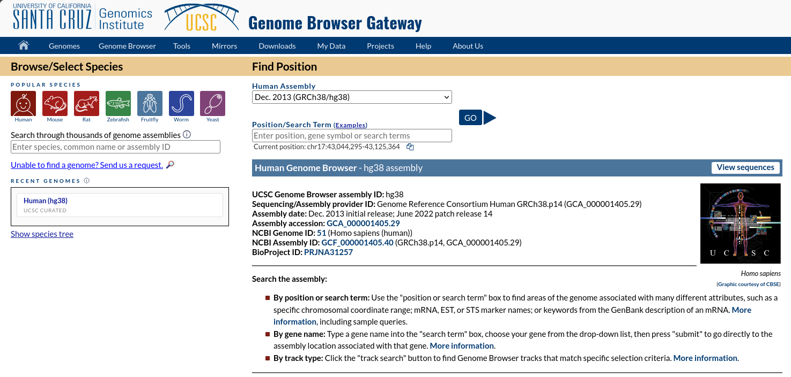
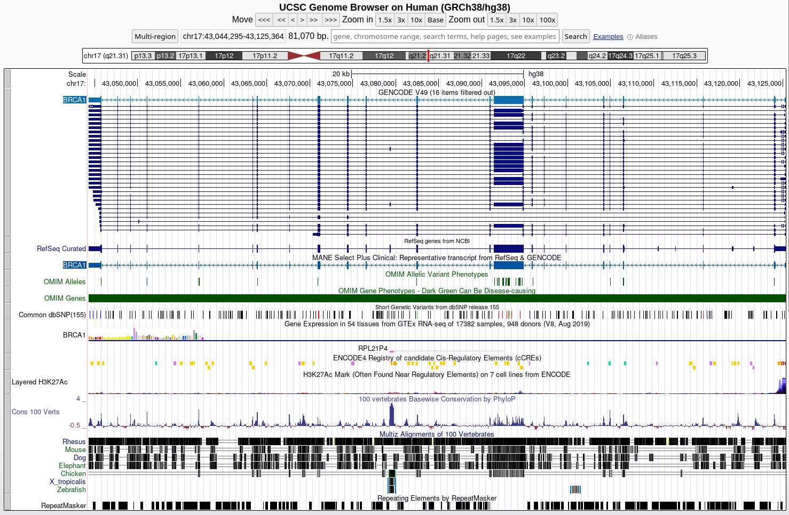
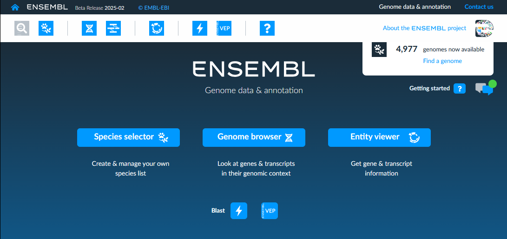
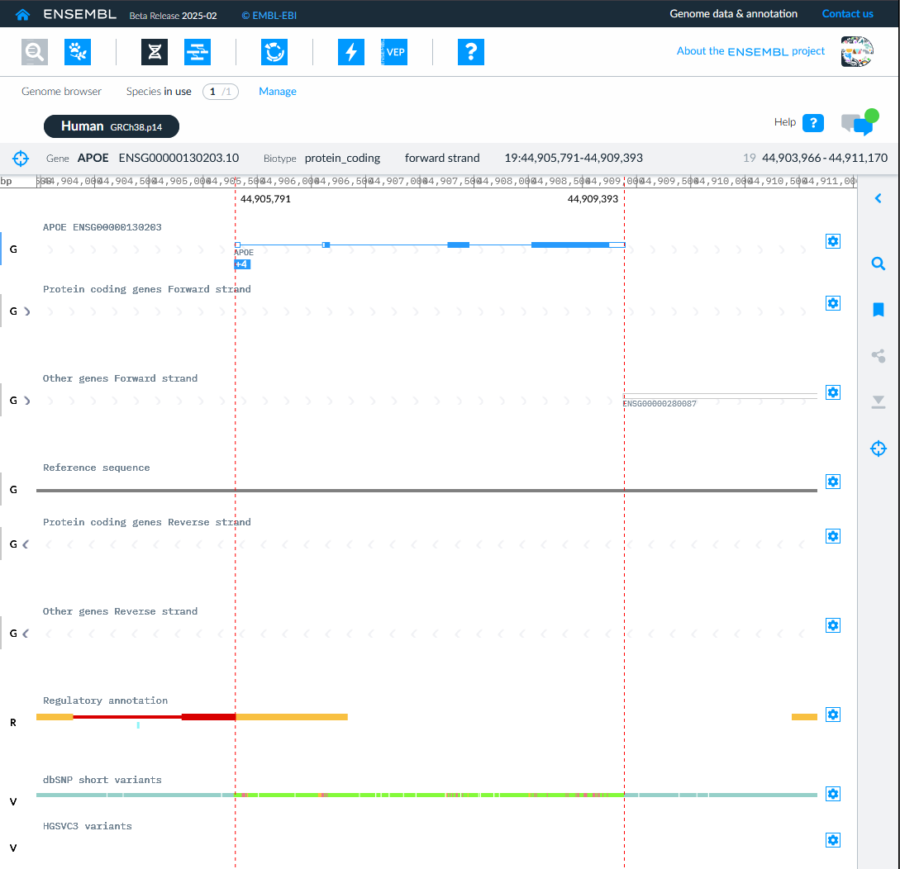
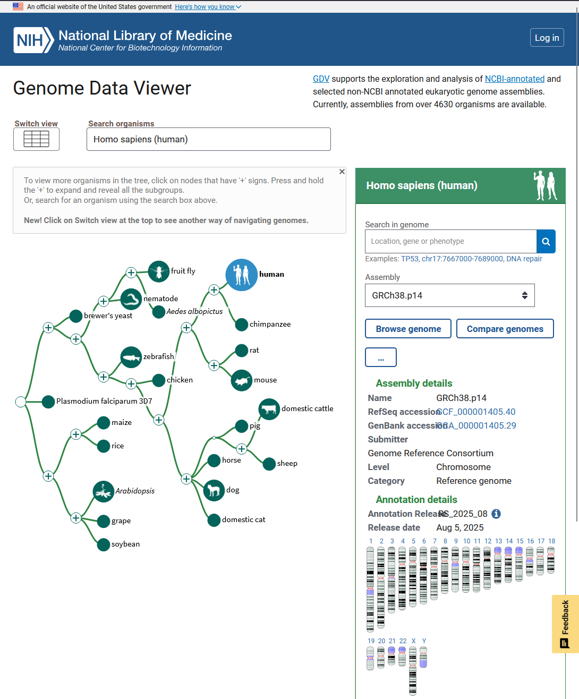
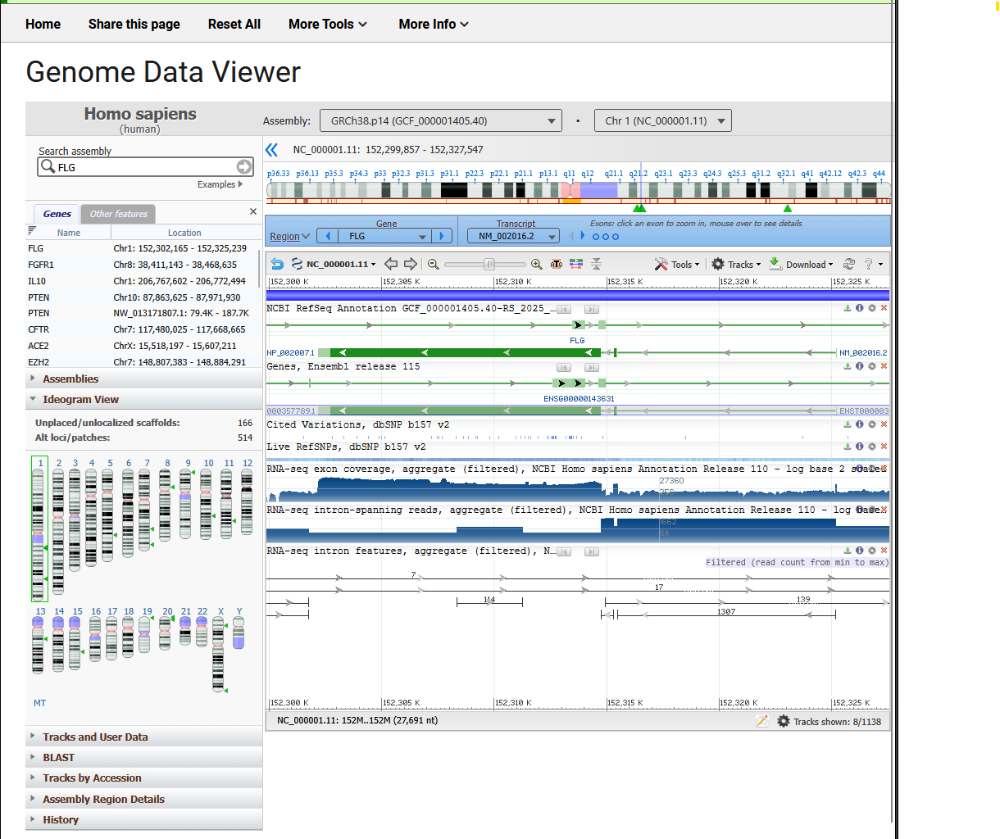

# Genome Browsers  

Genome browsers are essential bioinformatics tools used to visualize genomic regions, integrate biological datasets, and interpret gene structure and variation.  

This section highlights three widely used browsers:
- [UCSC Genome Browser](https://genome.ucsc.edu/cgi-bin/hgGateway)
- [Ensembl](https://beta.ensembl.org/)
- [NCBI Genome Data Viewer](https://www.ncbi.nlm.nih.gov/gdv)

---

# UCSC Genome Browser  

## Overview  
The [UCSC Genome Browser](https://genome.ucsc.edu/cgi-bin/hgGateway) is one of the most widely used tools for visualizing genomic regions and integrating biological data. It allows users to layer multiple datasets—such as gene annotations, conservation, regulatory elements, and variants—into a single, customizable view.

  
*UCSC Genome Browser landing page.*

## When to Use  
I typically use UCSC when I want to:
- Explore gene structure (exons, introns, alternative splicing)  
- Visualize a genomic region in detail  
- Investigate regulatory elements (promoters, enhancers)  
- Examine conservation across species  
- View known variants in genomic context

## Key Features  
- **Track System** → Layer multiple datasets in one view  
- **Genome Navigation** → Search by gene, coordinates, or variant  
- **Custom Tracks** → Upload and visualize your own data  
- **Comparative Genomics** → Multi-species conservation tracks  
- **Database Integration** → Links to external datasets and annotations

## Example Workflow  
### Goal: Investigate a gene and its surrounding genomic features  

1. Go to the [UCSC Genome Browser](https://genome.ucsc.edu/cgi-bin/hgGateway)  
2. Select reference genome (e.g., Human GRCh38/hg38)  
3. Search for a gene (e.g., *BRCA1*)  
4. Adjust the genomic region  
5. Enable key tracks:
   - Gene annotations  
   - Conservation  
   - Regulatory elements  
   - Variants  
6. Explore:
   - Exon/intron structure  
   - Conserved regions  
   - Nearby variants  

  
*UCSC Genome Browser view of the BRCA1 region.*

## Key Track Types

### Gene Annotation (GENCODE, RefSeq, MANE)
- Defines exon-intron structure and transcript isoforms  
- Foundation for interpreting all other tracks  
- MANE Select = standardized transcript  

### Variants (dbSNP, ClinVar, gnomAD)
- dbSNP → known variants  
- ClinVar → clinical significance  
- gnomAD → population frequency  

### Conservation (100 Vertebrates)
- Highlights evolutionarily conserved regions  
- Often indicates functional importance  

### Regulation (ENCODE, H3K27ac)
- Identifies promoters and enhancers  
- H3K27ac marks active regulatory regions  

### Expression (GTEx)
- Shows tissue-specific expression patterns  

### Repeats (RepeatMasker)
- Identifies repetitive DNA regions  
- Important for alignment and variant interpretation

## Interpretation
- **Gene + conservation** → likely functional regions  
- **Variants + frequency** → benign vs impactful  
- **Regulatory marks** → gene control mechanisms  
- **Expression** → tissue relevance

## Common Pitfalls  
- Using the wrong genome build (hg19 vs hg38)  
- Overinterpreting a single track  
- Turning on too many tracks and creating noise

## Notes / Tips  
- Turning tracks on/off is key to avoiding clutter  
- Save sessions when doing deeper analysis  
- Most powerful when combined with external databases  

---

# Ensembl  

## Overview  
[Ensembl](https://beta.ensembl.org/) provides highly detailed genome annotations and is especially strong for transcript-level analysis and comparative genomics. Compared to UCSC, it feels more structured and annotation-focused.

  
*Ensembl landing page*

## When to Use
- Detailed transcript isoform information  
- Variant effect predictions  
- Cross-species comparisons (orthologs)  
- Reliable gene annotation across organisms

## Key Features  
- Detailed gene and transcript models  
- Variant Effect Predictor (VEP)  
- Comparative genomics (orthologs, gene trees)  
- Multi-species genome support  
- BioMart for data export

## Example Workflow  
### Goal: Understand transcript variation and variant impact  

1. Search for a gene (e.g., *APOE*)  
2. Open the Gene Summary page  
3. Review transcript isoforms  
4. Examine variation data  
5. Run a variant through VEP  
6. Export relevant data if needed

  

## Notes / Tips  
- Ensembl IDs (ENSG…) differ from NCBI IDs  
- Transcript choice matters a lot for variant interpretation  
- Better than UCSC for structured annotation work  

---

# NCBI Genome Data Viewer  

## Overview  
NCBI Genome Data Viewer is a simpler genome browser that integrates directly with NCBI resources like RefSeq and ClinVar. It’s especially useful for clinically relevant interpretation.

  
*NCBI Genome Data Viewer interface.*

## When to Use
- Clinically curated variant information  
- RefSeq-based gene annotations  
- Quick validation using NCBI resources

## Key Features  
- RefSeq gene models  
- Integration with ClinVar and dbSNP  
- Direct links to NCBI Gene and PubMed  
- Simple and clean interface  

## Example Workflow  
### Goal: Check clinical relevance of a variant  

1. Search for a gene (e.g., *FLG*)  
2. Enable ClinVar and dbSNP tracks  
3. Select a variant  
4. Review clinical annotations  
5. Follow links to supporting literature

  

## Notes / Tips  
- More clinically oriented than Ensembl  
- Less customizable than UCSC  
- Best used alongside other tools rather than alone  

---

# Quick Comparison  

| Tool | Best used for                               |
|------|---------------------------------------------|
| UCSC | Visualization + integrating many data types |
| Ensembl | Deep annotation + transcript analysis       |
| NCBI GDV | Clinical interpretation + validation        |

---
